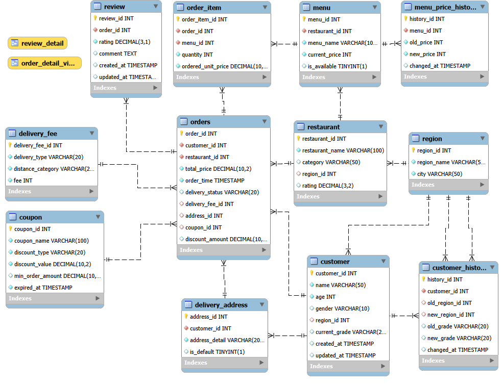

# 2026 Database Team Project

음식 배달 서비스 데이터베이스 애플리케이션

---

## 팀원 및 역할

| 이름 | 담당 테이블 & 뷰 | 담당 역할 |
| --- | --- | --- |
| 이시은 (팀장) | review,  order_detail_view  | Database 구현 및 DB(JDBC) 연동, 애플리케이션 구현, 검토 |
| 박고은 | orders, order_item, coupon | Database 구현 및 DB(JDBC) 연동, 애플리케이션 구현 |
| 장채린 | customer, customer_history, delivery_address, region | 레포트 작성 및 자료 제작 |
| 박시연 | restaurant, menu, menu_price_history, delivery_fee | 레포트 작성 및 자료 제작, 발표 |

---

## 실행 전 설정

### 1. 데이터베이스 생성

MySQL에서 아래 명령어를 실행하세요.

```sql
CREATE DATABASE food_delivery;
```

### 2. DB 연결 정보 수정

`src/com/deliveryapp/common/DBUtil.java` 파일을 열고 아래 username과 password를 본인 환경에 맞게 수정하세요.

```java
private static final String URL = "jdbc:mysql://localhost:3306/food_delivery";
private static final String USER = "root"; //혹은 권한이 있는 사용자
private static final String PASSWORD = "your_password";
```

### 3. 스키마 및 초기 데이터 삽입

아래 순서대로 SQL 파일을 실행하세요.

```
1. sql/createschema.sql  →  테이블, 뷰, 인덱스 생성
2. sql/initdata.sql      →  초기 데이터 삽입
```

---

## 애플리케이션 실행
jar 파일이 있는 경로에서 다음을 실행하세요.

```bash
java -jar 2026-Database.jar
```

- **메인 클래스:** `com.deliveryapp.Main`
- **JDK 버전:** Java 24
- **필요 라이브러리:** mysql-connector-java-8.0.33.jar

---

## 프로젝트 구조

```
2026-Database/
├── src/
│   └── com/deliveryapp/
│       ├── Main.java                    # 진입점
│       ├── common/
│       │   └── DBUtil.java              # DB 연결 관리
│       ├── controller/
│       │   ├── AppMenuController.java   # 메인 메뉴
│       │   ├── OrderController.java     # 주문 관련 메뉴
│       │   ├── CustomerController.java  # 고객 관련 메뉴
│       │   └── ReviewController.java    # 리뷰 관련 메뉴
│       │   └── FoodMenuController.java  # 식당 메뉴 관련 메뉴
│       ├── service/
│       │   ├── OrderService.java        # 주문 비즈니스 로직
│       │   ├── CustomerService.java     # 고객 비즈니스 로직
│       │   ├── RestaurantService.java   # 식당 비즈니스 로직
│       │   └── CouponService.java       # 쿠폰 비즈니스 로직
│       ├── dao/
│       │   ├── OrderDAO.java            # 주문 DB 쿼리
│       │   ├── CustomerDAO.java         # 고객 DB 쿼리
│       │   ├── RestaurantDAO.java       # 식당 DB 쿼리
│       │   └── CouponDAO.java           # 쿠폰 DB 쿼리
│       └── model/
│           ├── Order.java               # 주문 데이터 클래스
│           ├── Customer.java            # 고객 데이터 클래스
│           └── CustomerHistory.java     # 고객 변경 이력 클래스
├── sql/
│   ├── createschema.sql                 # 테이블/뷰/인덱스 생성
│   ├── initdata.sql                     # 초기 데이터 삽입
│   └── dropschema.sql                   # 모든 테이블 삭제
└── README.md
```

---

## 메뉴 구조

```
메인 메뉴
├── 1. 주문 관리
│   ├── 1. 주문하기                       [REQ5]
│   ├── 2. 주문 상세 조회 (VIEW 사용)       [REQ6]
│   ├── 3. 기간별 주문 통계                [REQ7]
│   ├── 4. 배달 상태 변경 (트랜잭션)         [REQ8]
│   └── 5. 주문 취소                      [REQ9]
├── 2. 고객 관리
│   ├── 1. 고객 정보 조회
│   ├── 2. 고객 지역 변경 (트랜잭션)        [REQ8]
│   ├── 3. 고객 등급 변경 (트랜잭션)        [REQ8]
│   ├── 4. 고객 정보 변화 전후 구매 분석     [REQ13]
│   ├── 5. 지역별 고객 구매 현황            [REQ14]
│   └── 6. 등급별 고객 구매 현황            [REQ14]
├── 3. 리뷰 관리
│   ├── 1. 리뷰 등록                      [REQ5]
│   ├── 2. 고객 리뷰 조회 (VIEW 사용) [REQ6]
│   ├── 3. 식당 리뷰 조회 (VIEW 사용) [REQ6]
│   ├── 4. 식당별 평점 집계               [REQ7]
│   └── 5. 리뷰 삭제                      [REQ9]
└── 4. 식당/메뉴 관리
    ├── 1. 메뉴 가격 변경 (트랜잭션)        [REQ8]
    └── 2. 가격 변경 전후 매출 분석         [REQ13]
```

---

## 데이터베이스 스크립트

| 파일 | 설명 |
| --- | --- |
| `sql/createschema.sql` | 테이블, 뷰, 인덱스 생성 |
| `sql/initdata.sql` | 초기 데이터 삽입 (각 테이블 10개 이상) |
| `sql/dropschema.sql` | 모든 테이블 삭제 |

---

## 기술 스택

| 항목 | 내용 |
| --- | --- |
| Language | Java 24 |
| Database | MySQL 8.0 |
| DB Driver | mysql-connector-java 8.0.33 |
| IDE | IntelliJ IDEA |
| Version Control | Git / GitHub |

---
## ER Diagram


